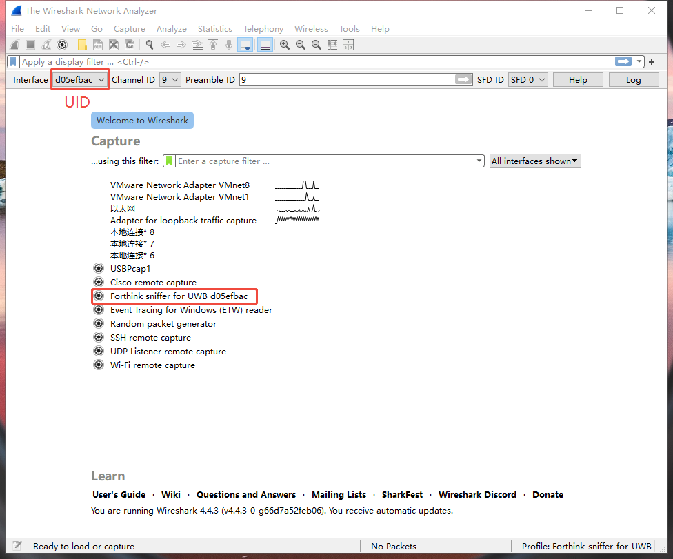

# Forthink UWB Sniffer Wireshark Plugin

简体中文 | [English](README.md)

## 1. 引言

这是一个兼容Wireshark的插件，基于Wireshark，使用四相科技提供的UWB-Dongle-Sniffer工具抓取周边的超宽带（Ultra Wide Band, UWB）数据。

支持硬件：[Forthink UWB Dongle Sniffer](https://item.taobao.com/item.htm?id=846844890768)

## 2. 使用说明

### 2.1 下载Wireshark

在您的PC上下载并安装[Wireshark](https://www.wireshark.org/download.html)，并确保它已安装在您的系统中。

对于Windows系统，可以下载64位版本，例如：`Wireshark-4.4.5-x64.exe`。

对于Linux系统（包括树莓派），按照以下指令安装Wireshark： 

`sudo apt-get update`

`sudo apt-get install wireshark`

运行wireshark时需要注意root权限： `sudo wireshark`

### 2.2 下载Forthink Sniffer插件

你可以从项目的exe目录中找到`forthink_sniffer.exe`插件，将其放到Wireshark的`extcap`文件夹下。

- 对于树莓派，将exe目录中`forthink_sniffer_linux_arm` 拷贝到extcap目录, 默认路径为`/usr/lib/aarch64-linux-gnu/wireshark/extcap`.

- 对于x64 Linux系统，将 `forthink_sniffer_linux_x86` 拷贝到extcap目录。

*注意：linux系统下，插件需要具备可执行权限。*

关于extcap目录的说明：

- extcap目录是Wireshark插件的存放目录，用于存储插件的可执行文件和其他相关文件。
- 在Windows系统中，extcap目录通常位于Wireshark安装目录下的`extcap`文件夹中。
- 通过Wireshark导航栏，`帮助->关于Wireshark->文件夹->全局配置`找到Wireshark安装目录。


### 2.3 配置文件

将`Forthink_sniffer_for_UWB`文件夹放到Wireshark安装目录下的`profiles`文件夹中。


在Wireshark右下角的配置中选择`Forthink_sniffer_for_UWB`配置。


### 2.4 配置接口工具栏

配置完成之后，重启或使用F5刷新Wireshark，可以在`视图->接口工具栏`中看到`Forthink Sniffer for UWB`的接口，勾选此选项。


选中此接口之后，可以在Wireshark顶部看到与UWB相关的工具栏。


### 2.5 配置UWB参数

将UWB Dongle Sniffer设备连接到电脑，并使用F5刷新Wireshark，将可以在主界面和工具栏上找到设备，每个设备都有其唯一的UID。

可以在工具栏中配置Sniffer的相关工作参数，包括信道、前导码ID、SFD ID。




### 2.6 开启捕获

参数配置后，可以开启捕获，并且可以看到Sniffer抓取到的UWB数据包。


捕获结果可以看到完整的IEEE 802.15.4数据包结构：帧控制段、AUX Security Header、Header IEs、Payload IE、Payload、CRC。


对于特定应用场景需要过滤特定的UWB数据包，可以使用Wireshark的过滤器功能。例如，你可以直接过滤器```_ws.col.def_dst == "0x09d9"``` 以过滤到特定的目的地址。to filter the UWB packets.


## 3. 发布日志

### （2025.2.27-v0.0.3)
- **特性**:
  - 增加了Linux系统插件支持，支持x64与树莓派。

### (2025.02.24-v0.0.2)
- **特性**:
  - 第一版发布，当前仅仅提供了windows平台的插件支持，尚未实现详细的FiRa或CCC协议解析参数配置以及数据解析。

## 4. 联系我们

- 官网: https://www.forthink.com.cn
- 邮箱: dksupports@everhigh.com.cn
- 淘宝:  [四相科技](https://shop224007954.taobao.com/)
- Github: https://github.com/forthink-xyz/