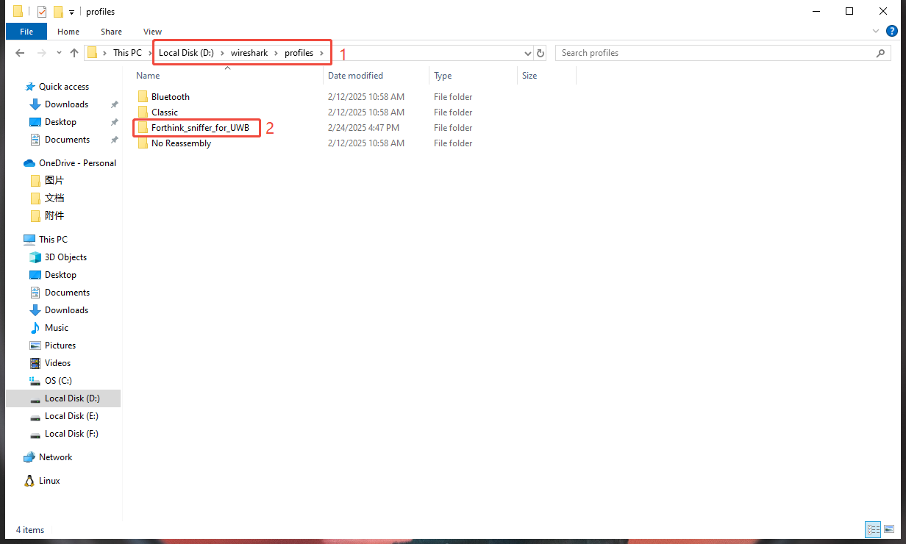
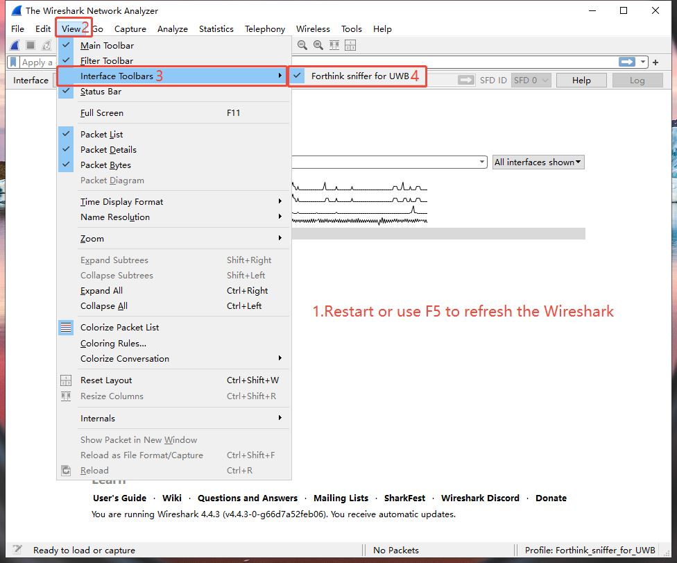
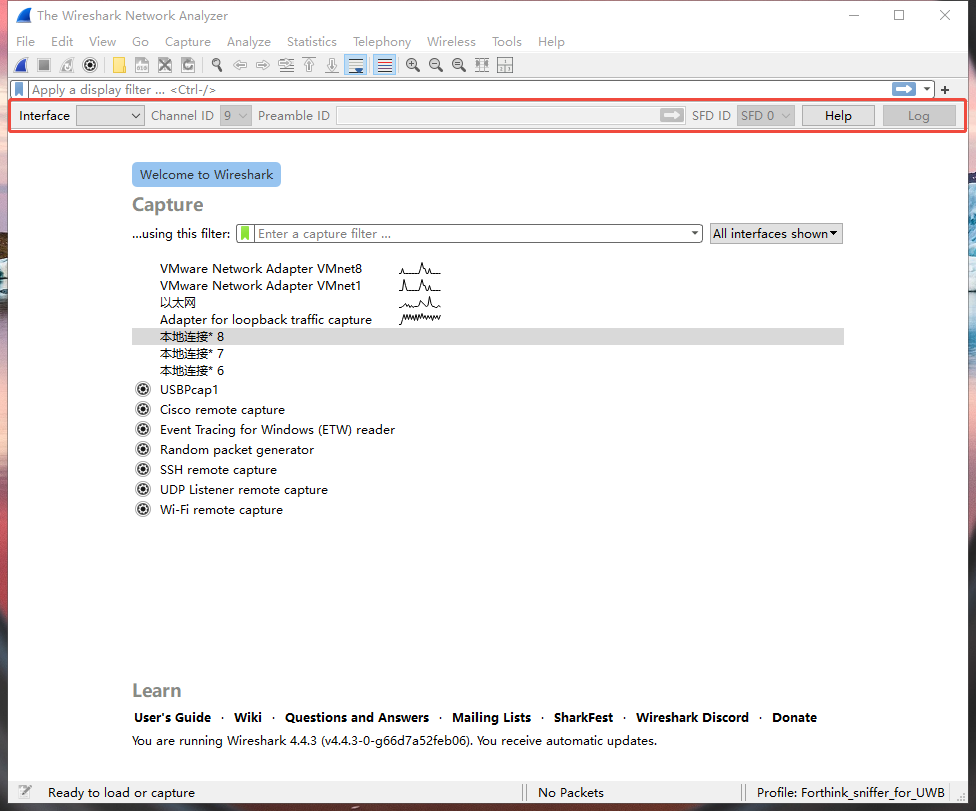
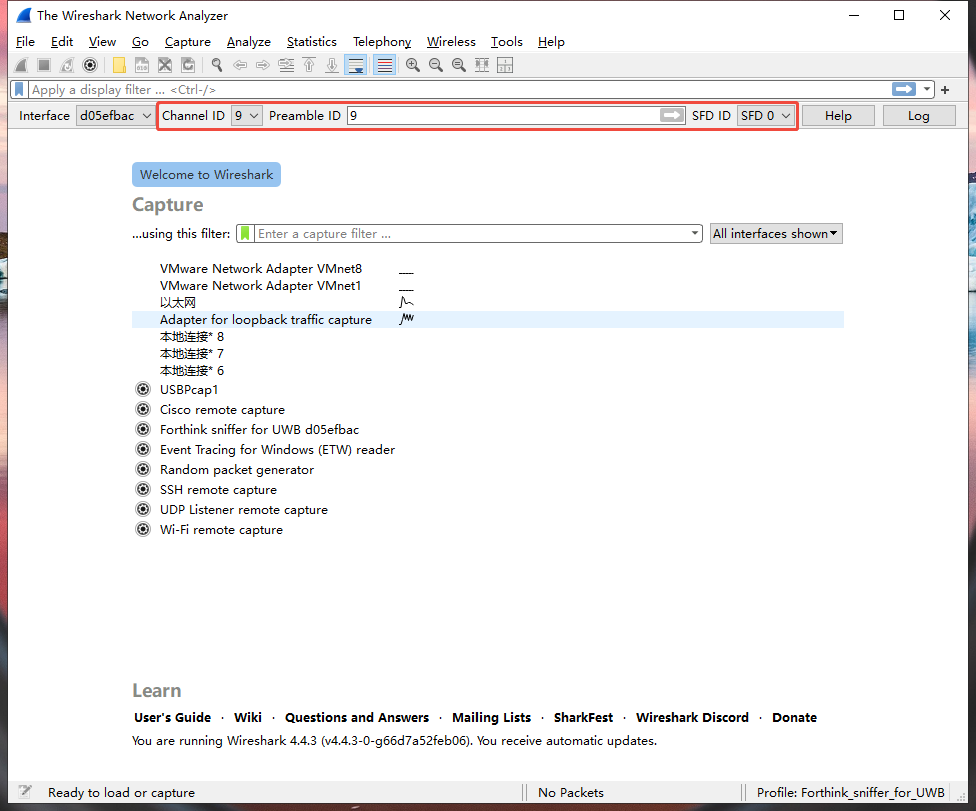
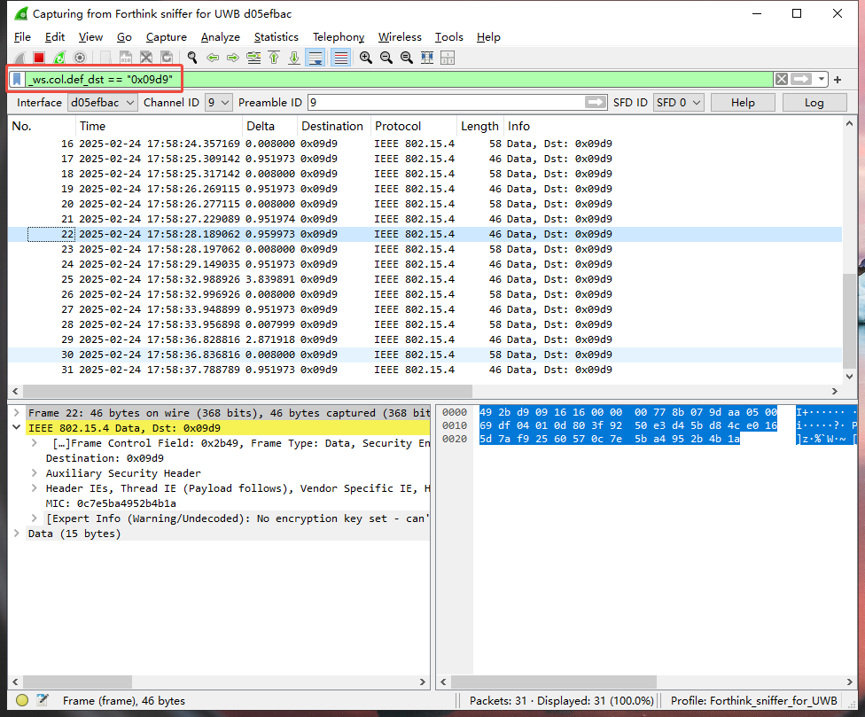

# Forthink UWB Sniffer Wireshark Plugin

English | [简体中文](README-zh.md)

## 1. Introduction

The Plugin is a Wireshark plugin that can be used to capture the Ultra Wide Band(UWB) data with a [Forthink UWB-Dongle-Sniffer](https://item.taobao.com/item.htm?id=846844890768).


Supported Hardware: Forthink UWB-Dongle-Sniffer. You can get the device from:
 - Taobao : [Forthink Store](https://item.taobao.com/item.htm?id=846844890768)
 - Aliexpress : [Heltec Store](https://www.aliexpress.com/item/1005008512068697.html)

## 2. UserManual

### 2.1 Download Wireshark

Download and install Wireshark on your PC: [Wireshark](https://www.wireshark.org/download.html)

For Windows, you can download the 64-bit version, `Wireshark-4.4.5-x64.exe`.

For Linux or Raspberry Pi:

`sudo apt-get update`

`sudo apt-get install wireshark`

To run the wireshark, use root privileges: `sudo wireshark`


### 2.2 Download UWB Dongle Sniffer Plugin App

Download `forthink_sniffer.exe` on your PC, and put it in extcap folder of Wireshark.

- For raspberry pi, copy the `forthink_sniffer_linux_arm` to the extcap folder, the default path is `/usr/lib/aarch64-linux-gnu/wireshark/extcap`.

- For linux x64 copy the `forthink_sniffer_linux_x86` to the extcap folder.

*Notice: the plugin file should be have executable permissions.*

You can find the extcap folder in Wireshark navigation bar, `Help -> About Wireshark -> Folders -> Global configuration`.


### 2.3 Configure Analysis Interface

Download `Forthink_sniffer_for_UWB` folder on your PC, and put it in `profiles` folder of Wireshark.



Configure the analysis interface in the lower right corner of the Wireshark.


### 2.4 Configure Interface Toolbar

After the Configuration, restart or use F5 to refresh the Wireshark, you can see the "Forthink Sniffer for UWB" in `View -> interface toolbar`, check this option.



After check this option, you can see a new toolbar on the top of Wireshark.



### 2.5 Configure UWB Parameters

Connect the UWB-Dongle-Sniffer device to your PC, and use F5 to refresh the Wireshark, you can see it on the main interface and toolbar. If you connect more than one sniffer, you can use UID to distinguish them, each device has a unique UID.


You can configure parameters of the UWB Sniffer in the toolbar, include Channel, Preamble Code, SFD ID.




### 2.6 Start Sniffing

After configuration parameters, you can start sniffing, and you can see the UWB packets which the UWB sniffer captured.


You can add filter in the filter bar. For example, you can add filter ```_ws.col.def_dst == "0x09d9"``` to filter the UWB packets.



## 3. Release log
### (2025.02.27-v0.0.3)
- **Features**:
  - Suppport Linux x64 and Raspberry Pi.

### (2025.02.24-v0.0.2)
- **Features**:
  - First version, currently only support the Forthink UWB Dongle Sniffer Hardware, only support the Windows platform. Don't implement the FiRa or CCC protocol parsing.

## 4. Contact us

- WebSite: https://www.forthink.com.cn
- License: https://licenses.forthink.com.cn/
- Email: dksupports@everhigh.com.cn
- Shop:  [Forthink store](https://shop224007954.taobao.com/)
- Github forthink_uwb_sniffer_tool: [Sniffer Tool](https://github.com/forthink-xyz/forthink_uwb_sniffer_tool.git)